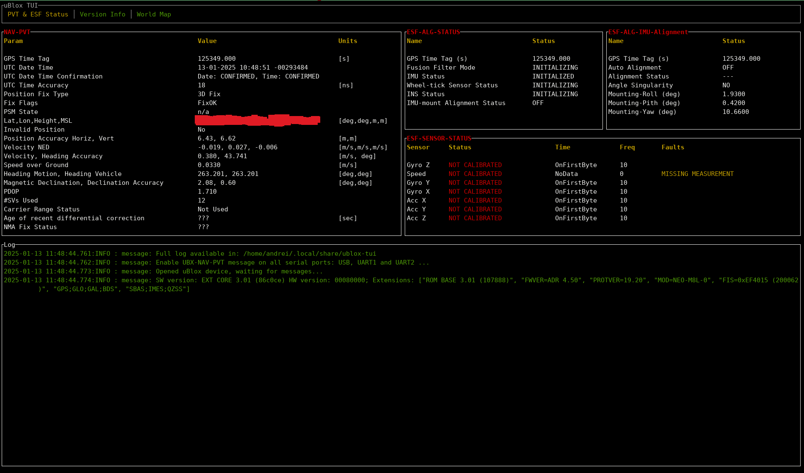

# Examples

This folder contains the following examples
 - [simple-parse](./simple-parse)
 - [basic-cli](./basic-cli)
 - [send-receive](./send-receive)
 - [ublox-tui](./ublox-tui)
 - [DDS](./dds/)

# simple-parse

Minimal example of opening a serial device, reading and parsing ubx packets from it.

This example requires the device to have been preconfigured to output messages.

To run the example with uBlox protocol 23 run

```shell
cargo run -p simple-parse -- -p /dev/ttyACM0
```

To run it for other protocol versions, first disable the default features and then enable the specific features needed, e.g.,

```shell
cargo run -p simple-parse --no-default-features --features alloc,ubx_proto27 -- -p /dev/ttyACM0 
```

# uBlox Device - This kind of ruins all the examples because the device is so generic and complex!

The device configuration and the reading of packets as well as some common CLI arguments have been abstracted away into an `ublox-device` library. This library is for convenience only as it is used throughout all of the examples.

# basic-cli

To run the example with the default features (uBlox protocol 23) run
```shell
cargo run -p basic-cli -- -p /dev/ttyACM0 
```
To run it for other protocol versions, first disable the default features and then enable the specific features needed, e.g.,
```shell
cargo run -p basic-cli --no-default-features --features alloc,ubx_proto27 -- -p /dev/ttyACM0 

```

The example shows how to interact with an uBlox device. In this example the `NAV-PVT` message is enabled to be sent periodically on all UART and USB ports. It also makes a single request for the `MON-VER` message. The main loop parses incoming packets and outputs the result on `stdout`. 

# send-receive 

To run the example with the default features (uBlox protocol 23) run
```shell
cargo run -p send-receive -- -p /dev/ttyACM0 
```
To run it for other protocol versions, first disable the default features and then enable the specific features needed, e.g.,
```shell
cargo run -p send-receive --no-default-features --features alloc,ubx_proto27 -- -p /dev/ttyACM0 
```

This example builds upon the `basic-cli` example. It shows how to clone the `serialport` device and use two separate threads, one for reading incoming packets and one for sending configuration and request packets.

# ublox-tui

To run the example with the default features (uBlox protocol 23) run
```shell
cargo run -p ublox-tui -- -p /dev/ttyACM0
```

This TUI is based on the [Ratatui demo app](https://github.com/ratatui/ratatui/tree/main/examples/apps/demo). It is implemented only for the `crossterm` backend.

Currently, the TUI has support to display NAV-PVT, ESF-IMUALG, ESF-STATUS and MON-VER status. It also uses `ratatui` charts and `ratatui` world-map to display real-time ESF sensor data (accelerometer and gyroscope values) and your current position on a Braille world map view.

To run the TUI, provide the port as an CLI argument. 
```shell
cargo run -- -p /dev/ttyACM0
```

You should see a TUI with multiple tabs similar to the below image. You can use Left/Right arrows or `h/l` keys to switch tabs.



# DDS

[Data Distribution Service (DDS)](https://www.dds-foundation.org/) is a pub/sub communication middleware. The DDS example shows how to expose certain UBX messages, like the NAV-PVT message to other hosts on the same LAN network as the publishing node. 

To build the binaries for this example with the default features (uBlox protocol 23) run
```shell
cargo build -p dds 
```

Open one terminal window and run 
```shell
cargo run -p dds --bin dds-nav-pvt-publisher -- -p /dev/ttyACM0
```

The node will start publishing the NAV-PVT message over the network using UDP on the DDS topic `ubx-nav-pvt`. The output would be similar to the one below
```shell
[INFO ] Default to BestEffort QoS as no argument was provided on cmdline
[INFO ] Creating participant for domain ID: 0
[INFO ] UDPListener: new socket with address Ok(0.0.0.0:7400)
[INFO ] UDPListener: new socket with address Ok(0.0.0.0:7410)
[INFO ] ParticipantId 0 selected.
[INFO ] UDPListener: new socket with address Ok(0.0.0.0:7401)
[INFO ] UDPListener: new socket with address Ok(0.0.0.0:7411)
[INFO ] New DomainParticipantInner: domain_id=0 participant_id=0 GUID=GUID {01125f2cd7fad8e173114559 EntityId::PARTICIPANT} security_feature_enabled=false
[INFO ] UDPSender: Multicast sender on interface 10.231.176.58
[INFO ] UDPSender: Multicast sender on interface 172.17.0.1
[INFO ] UDPSender::new() --> UDPSender { unicast_socket: UdpSocket { addr: 0.0.0.0:34899, fd: 13 }, multicast_sockets: [UdpSocket { addr: 10.231.176.58:53780, fd: 14 }, UdpSocket { addr: 172.17.0.1:58626, fd: 15 }] }
[INFO ] New remote participant: SpdpDiscoveredParticipantData { updated_time: 2025-03-17T12:10:47.604327921Z, protocol_version: 2.3, vendor_id: RustDDS / Atostek, expects_inline_qos: false, participant_guid: GUID {01125f2cd7fad8e173114559 EntityId::PARTICIPANT}, metatraffic_unicast_locators: [UdpV4(10.231.176.58:7410), UdpV4(172.17.0.1:7410)], metatraffic_multicast_locators: [UdpV4(239.255.0.1:7400)], default_unicast_locators: [UdpV4(10.231.176.58:7411), UdpV4(172.17.0.1:7411)], default_multicast_locators: [UdpV4(239.255.0.1:7401)], available_builtin_endpoints: BuiltinEndpointSet { value: 402656319 }, lease_duration: Some(infinite), manual_liveliness_count: 0, builtin_endpoint_qos: None, entity_name: None }
[INFO ] Remote participant GUID {01125f2cd7fad8e173114559 EntityId::PARTICIPANT} is myself, but some reflection is good.
[INFO ] Discovery started. Participant constructed.
[INFO ] Creating Publisher
[INFO ] Creating topic 'ubx-nav-pvt' with type 'NavPvt'
[INFO ] Creating DataWriter for topic 'ubx-nav-pvt'
[...]
[INFO ] Published new NavPvt message on DDS at: 0.055467 [sec] since start
[INFO ] Published new NavPvt message on DDS at: 0.152084 [sec] since start
[INFO ] Published new NavPvt message on DDS at: 0.264861 [sec] since start
[INFO ] Published new NavPvt message on DDS at: 0.352926 [sec] since start
[INFO ] Published new NavPvt message on DDS at: 0.452147 [sec] since start
[INFO ] Published new NavPvt message on DDS at: 0.558537 [sec] since start
[...]
[INFO ] Published new NavPvt message on DDS at: 3.152082 [sec] since start
[INFO ] Published new NavPvt message on DDS at: 3.256669 [sec] since start
[INFO ] Published new NavPvt message on DDS at: 3.354396 [sec] since start
[INFO ] Published new NavPvt message on DDS at: 3.452344 [sec] since start
[INFO ] Published new NavPvt message on DDS at: 3.554243 [sec] since start
[INFO ] Published new NavPvt message on DDS at: 3.654353 [sec] since start
```


In another terminal run the Subscriber node
```shell
cargo run -p dds --bin dds-subscriber
```

On successful matching of the topic `ubx-nav-pvt`, the subscriber will start receiving the NAV-PVT data and output it to the `stdout`
```
cargo run -p dds --bin dds-subscriber
[INFO ] Creating participant for domain ID: 0
[INFO ] UDPListener: new socket with address Ok(0.0.0.0:7400)
[INFO ] UDPListener: new socket with address Ok(0.0.0.0:7410)
[INFO ] ParticipantId 0 selected.
[INFO ] UDPListener: new socket with address Ok(0.0.0.0:7401)
[INFO ] UDPListener: new socket with address Ok(0.0.0.0:7411)
[INFO ] New DomainParticipantInner: domain_id=0 participant_id=0 GUID=GUID {011212d9a791f86c50e68c07 EntityId::PARTICIPANT} security_feature_enabled=false
[INFO ] UDPSender: Multicast sender on interface 10.231.176.58
[INFO ] UDPSender: Multicast sender on interface 172.17.0.1
[INFO ] UDPSender::new() --> UDPSender { unicast_socket: UdpSocket { addr: 0.0.0.0:49431, fd: 15 }, multicast_sockets: [UdpSocket { addr: 10.231.176.58:57360, fd: 16 }, UdpSocket { addr: 172.17.0.1:32794, fd: 24 }] }
[INFO ] New remote participant: SpdpDiscoveredParticipantData { updated_time: 2025-03-17T12:09:47.327099461Z, protocol_version: 2.3, vendor_id: RustDDS / Atostek, expects_inline_qos: false, participant_guid: GUID {011212d9a791f86c50e68c07 EntityId::PARTICIPANT}, metatraffic_unicast_locators: [UdpV4(10.231.176.58:7410), UdpV4(172.17.0.1:7410)], metatraffic_multicast_locators: [UdpV4(239.255.0.1:7400)], default_unicast_locators: [UdpV4(10.231.176.58:7411), UdpV4(172.17.0.1:7411)], default_multicast_locators: [UdpV4(239.255.0.1:7401)], available_builtin_endpoints: BuiltinEndpointSet { value: 402656319 }, lease_duration: Some(infinite), manual_liveliness_count: 0, builtin_endpoint_qos: None, entity_name: None }
[INFO ] Remote participant GUID {011212d9a791f86c50e68c07 EntityId::PARTICIPANT} is myself, but some reflection is good.
[INFO ] Discovery started. Participant constructed.
[INFO ] Default to BestEffort QoS as no argument was provided on cmdline
[INFO ] Matched new remote reader on topic="DCPSParticipant" reader=GUID {011212d9a791f86c50e68c07 EntityId::SPDP_BUILTIN_PARTICIPANT_READER}
[INFO ] Creating Subscriber
[INFO ] Matched new remote reader on topic="DCPSSubscription" reader=GUID {011212d9a791f86c50e68c07 EntityId::SEDP_BUILTIN_SUBSCRIPTIONS_READER}
[INFO ] Matched new remote reader on topic="DCPSPublication" reader=GUID {011212d9a791f86c50e68c07 EntityId::SEDP_BUILTIN_PUBLICATIONS_READER}
[INFO ] Matched new remote reader on topic="DCPSTopic" reader=GUID {011212d9a791f86c50e68c07 EntityId::SEDP_BUILTIN_TOPIC_READER}
[...]
[INFO ] topic ubx-nav-pvt: NavPvt { key: "empty", itow: 1303100, year: 1980, month: 1, day: 6, hour: 0, min: 21, sec: 43, nanosec: 100000019, utc_time_accuracy: 4294967295, lat: 0.0, lon: 0.0, height: 0.0, msl: -17.0, horizontal_accuracy: 4294967.5, vertical_accuracy: 3750090.5, vel_n: 0.0, vel_e: 0.0, vel_d: 0.0, speed_over_ground: 0.0, velocity_accuracy: 20.0, heading_motion: 0.0, heading_vehicle: 0.0, heading_accuracy: 180.0, magnetic_declination: 0.0, magnetic_declination_accuracy: 0.0, pdop: 99.99, satellites_used: 0, gps_fix_type: 0, fix_flags: 0, llh_validity: true, time_confirmation_flags: 36 }
[INFO ] topic ubx-nav-pvt: NavPvt { key: "empty", itow: 1303200, year: 1980, month: 1, day: 6, hour: 0, min: 21, sec: 43, nanosec: 200000020, utc_time_accuracy: 4294967295, lat: 0.0, lon: 0.0, height: 0.0, msl: -17.0, horizontal_accuracy: 4294967.5, vertical_accuracy: 3750090.5, vel_n: 0.0, vel_e: 0.0, vel_d: 0.0, speed_over_ground: 0.0, velocity_accuracy: 20.0, heading_motion: 0.0, heading_vehicle: 0.0, heading_accuracy: 180.0, magnetic_declination: 0.0, magnetic_declination_accuracy: 0.0, pdop: 99.99, satellites_used: 0, gps_fix_type: 0, fix_flags: 0, llh_validity: true, time_confirmation_flags: 36 }
[INFO ] topic ubx-nav-pvt: NavPvt { key: "empty", itow: 1303300, year: 1980, month: 1, day: 6, hour: 0, min: 21, sec: 43, nanosec: 300000007, utc_time_accuracy: 4294967295, lat: 0.0, lon: 0.0, height: 0.0, msl: -17.0, horizontal_accuracy: 4294967.5, vertical_accuracy: 3750090.5, vel_n: 0.0, vel_e: 0.0, vel_d: 0.0, speed_over_ground: 0.0, velocity_accuracy: 20.0, heading_motion: 0.0, heading_vehicle: 0.0, heading_accuracy: 180.0, magnetic_declination: 0.0, magnetic_declination_accuracy: 0.0, pdop: 99.99, satellites_used: 0, gps_fix_type: 0, fix_flags: 0, llh_validity: true, time_confirmation_flags: 36 }
[INFO ] topic ubx-nav-pvt: NavPvt { key: "empty", itow: 1303400, year: 1980, month: 1, day: 6, hour: 0, min: 21, sec: 43, nanosec: 400000008, utc_time_accuracy: 4294967295, lat: 0.0, lon: 0.0, height: 0.0, msl: -17.0, horizontal_accuracy: 4294967.5, vertical_accuracy: 3750090.5, vel_n: 0.0, vel_e: 0.0, vel_d: 0.0, speed_over_ground: 0.0, velocity_accuracy: 20.0, heading_motion: 0.0, heading_vehicle: 0.0, heading_accuracy: 180.0, magnetic_declination: 0.0, magnetic_declination_accuracy: 0.0, pdop: 99.99, satellites_used: 0, gps_fix_type: 0, fix_flags: 0, llh_validity: true, time_confirmation_flags: 36 }
[...]
```  