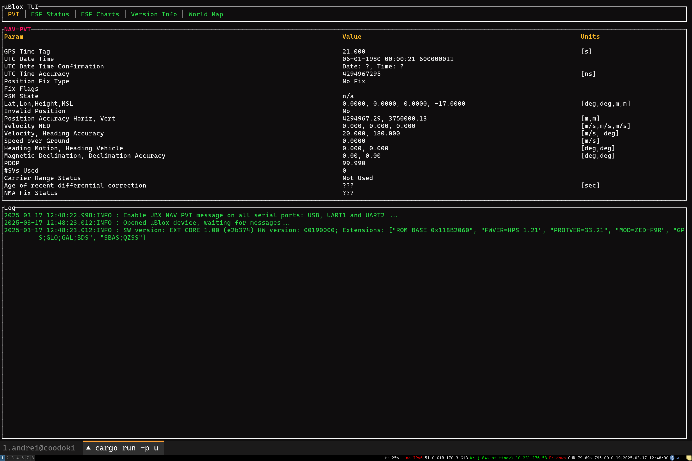

# TUI example

This TUI is based on the [Ratatui demo app](https://github.com/ratatui/ratatui/tree/main/examples/apps/demo)

It is implemented ony for the `crossterm` backend.

It will show the NAV-PVT and ESF-ALG, ESF-STATUS messages similar to the u-center UI from uBlox.

```shell
cargo run -p /dev/ttyACM0
```

You should see a TUI like this




